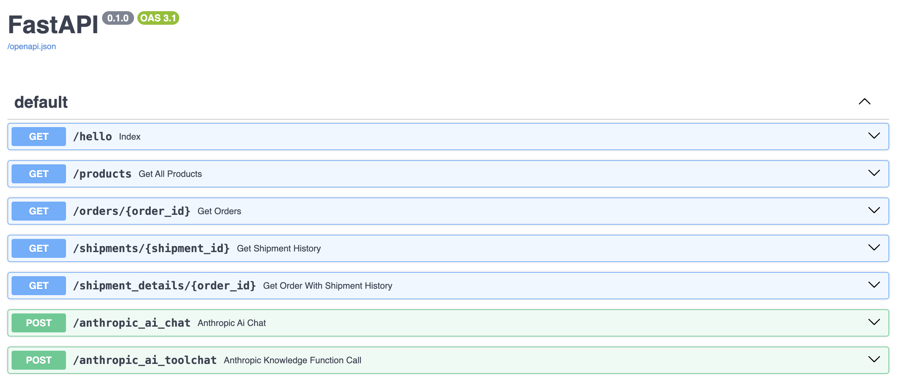

# MULTI-FUNCTION CALLING WITH ANTHROPIC

## 1. RUN DOCKER

| docker compose up

## 1. SAMPLE API

On running docker composer you will have access to http://localhost:8000/docs

### 1.1. API Description

- /products has details of multiple products. Use it as knowledge store (data/product.json)

-  /orders/{order_id} return details of order (data/order.json)

-  /shipments/{shipment_id} return details of shipment history (data/tracker.json)

-  /shipment_details/{order_id} return details of order with shipment history 

        tools = [
                {
                    "name": "get_order",
                    "description": "Fetches details of a specific order by its unique identifier.",
                    "parameters": {
                    "type": "object",
                    "properties": {
                        "order_id": {
                        "type": "string",
                        "description": "The unique identifier of the order."
                        }
                    },
                    "required": ["order_id"]
                    }
                },
                {
                    "name": "get_shipment_history",
                    "description": "Fetches the complete shipment history of a specific shipment by its unique identifier.",
                    "parameters": {
                    "type": "object",
                    "properties": {
                        "shipment_id": {
                        "type": "string",
                        "description": "The unique identifier of the shipment."
                        }
                    },
                    "required": ["shipment_id"]
                    }
                },
                {
                    "name": "get_order_with_shipment_history",
                    "description": "Fetches details of a specific order and its related shipment history by the order's unique identifier.",
                    "parameters": {
                    "type": "object",
                    "properties": {
                        "order_id": {
                        "type": "string",
                        "description": "The unique identifier of the order."
                        }
                    },
                    "required": ["order_id"]
                    }
                }
            ]

### 2. Notebook
    Step-by-step process are available in notebook files in notebook folder, you can run gradio to have chat experience. 